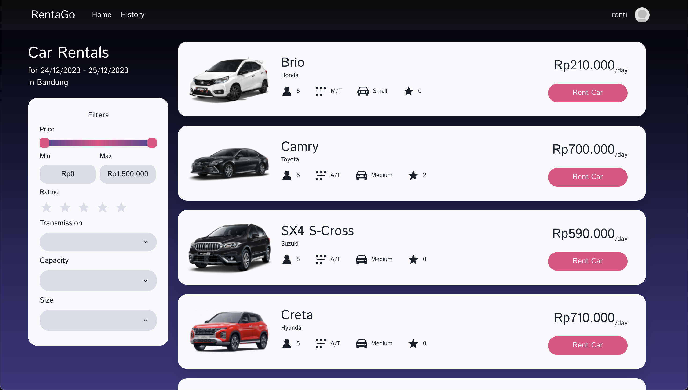
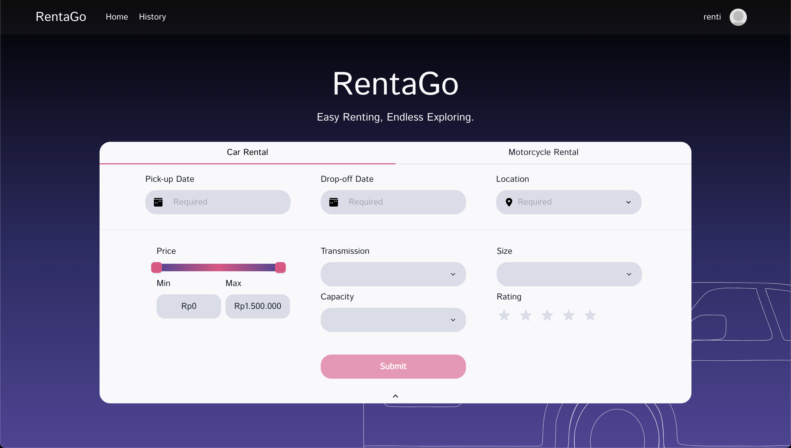
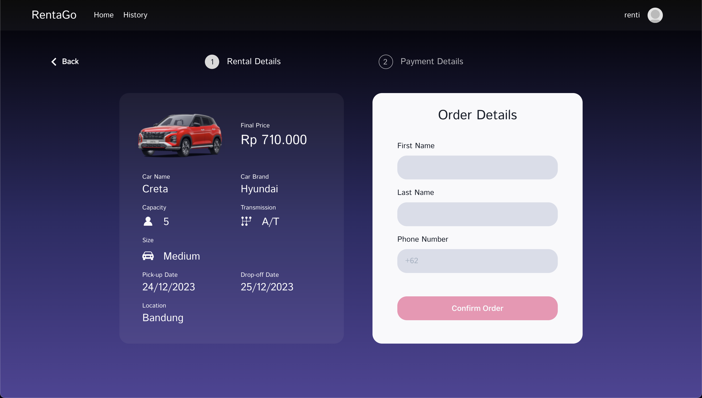
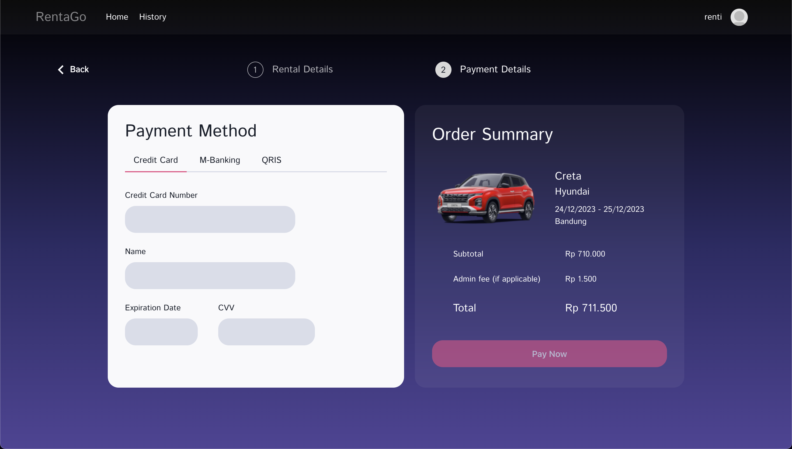
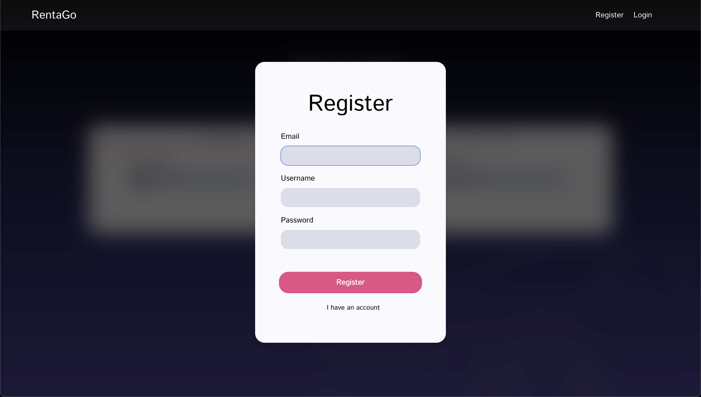
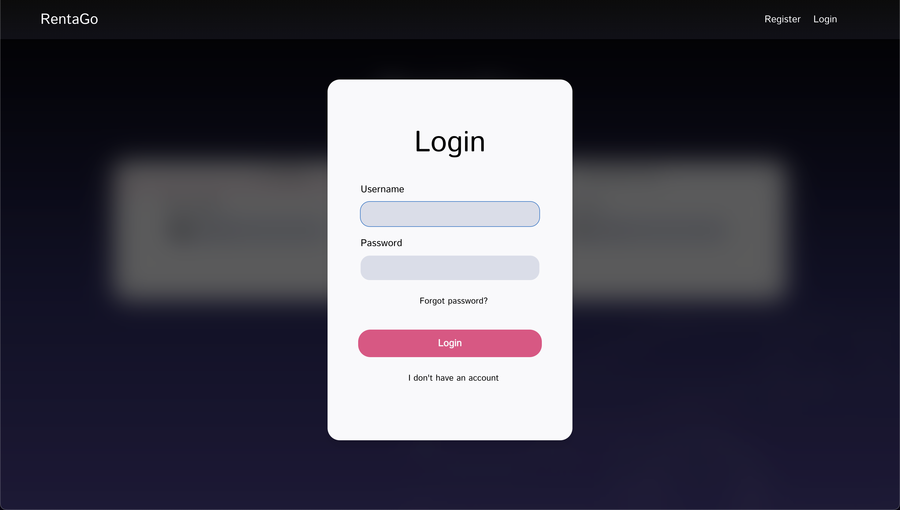
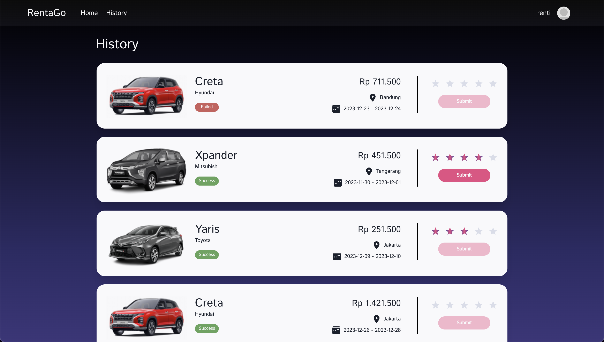
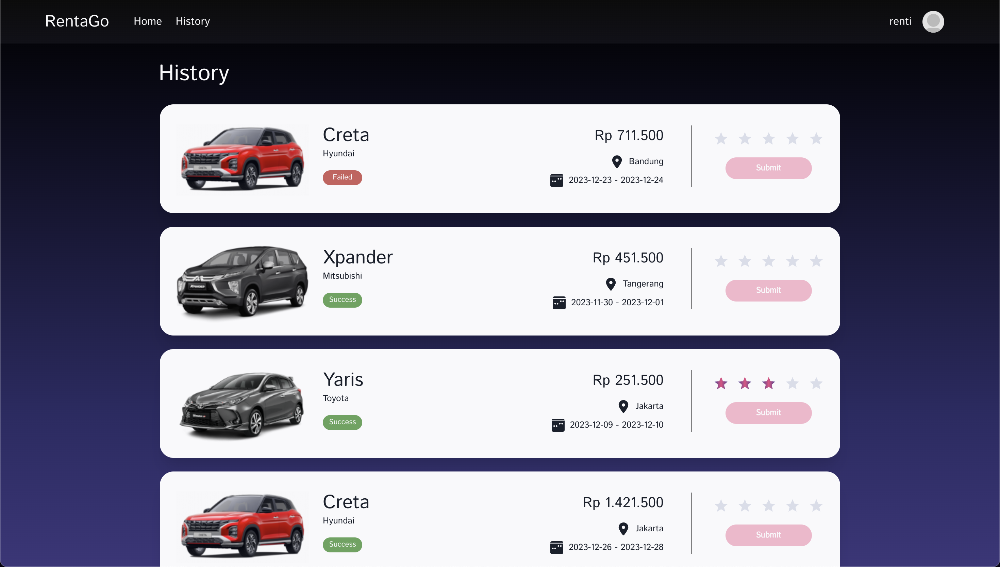
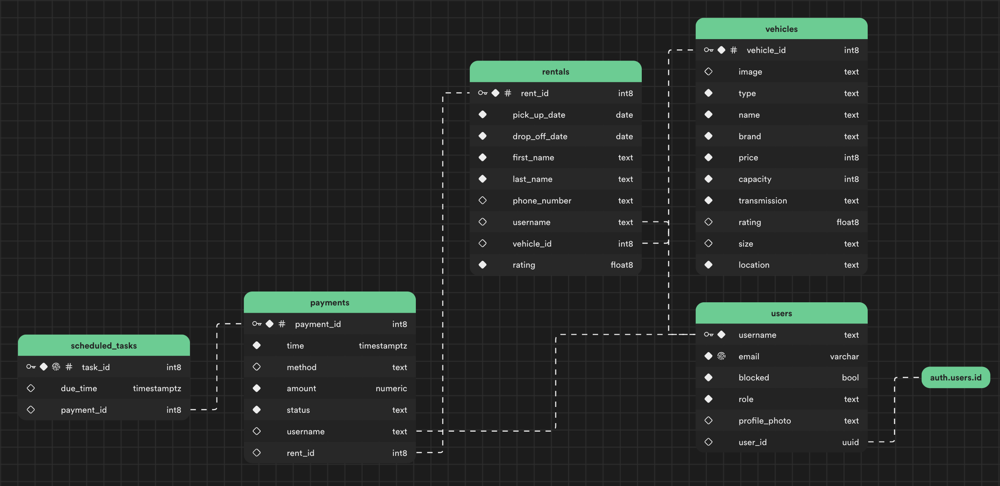

# RentaGo
Group A - K03
- 18221014 Raden Sjora Okalani
- 18221016 Justin Yusuf Abidjoko
- 18221020 Aniqa Fayyaza Akbar
## Description
RentaGo is a web-based software application that serves vehicle rental. The system has the ability to facilitate customers who want to rent  vehicles, such as cars and motorcycles. The system can be used by customers to view the available vehicle catalog according to their preferences, rent a vehicle, and give a rating.

## How to Run RentaGo
### Using Link
Open the URL rentago.vercel.app

### From Local Host
Pre-Requisite: yarn is already installed
1. Clone this repository
2. Go to the folder where the repository is cloned
3. Open "rentago" folder in terminal
4. Type "yarn install" to install every dependencies inside of this project
5. Once it's done, type "yarn start" to start the localhost server 

## Implemented Use Cases
### UC-01 Melihat Katalog Kendaraan
18221016 - Justin Yusuf Abidjoko

### UC-02 Filtering Katalog Kendaraan 
18221014 - Raden Sjora Okalani

### UC-03 Melakukan Penyewaan Kendaraan
18221020 - Aniqa Fayyaza Akbar

### UC-04 Melakukan Pembayaran
18221016 - Justin Yusuf Abidjoko

### UC-05 Registrasi
18221014 - Raden Sjora Okalani

### UC-06 Login
18221020 - Raden Sjora Okalani

### UC-07 Memberikan Rating
18221016 - Justin Yusuf Abidjoko

### UC-08 Melihat Riwayat Penyewaan
18221020 - Aniqa Fayyaza Akbar

## Database

## Unit Testing
[Unit Testing Document](https://docs.google.com/document/d/1p8kzpJFMTxErfERZAT2g0HOXaqJyjyGvkmz7l1ZxBx0/edit)

